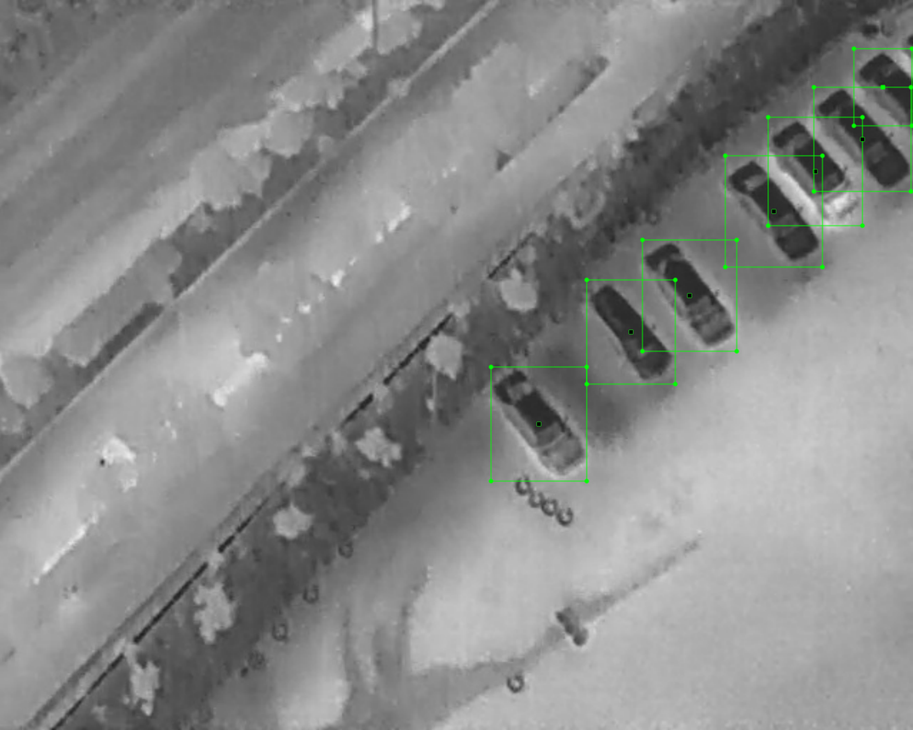
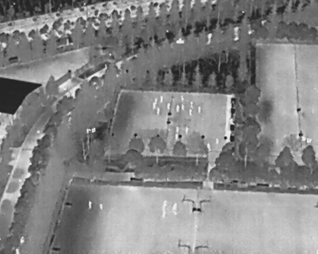
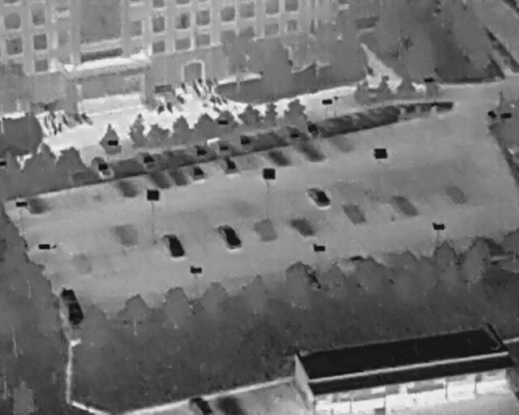

# HIT-UAV: A High-altitude Infrared Thermal Dataset for Unmanned Aerial Vehicles
## Introduction
The HIT-UAV contains 2898 infrared thermal images extracted from 43470 frames, captured by UAV from different scenes (schools, parking lots, roads, playgrounds, etc.), covering a wide range of aspects including objects (Person, Bicycle, Car, OtherVehicle), flight altitude data (from 60 to 130 meters), camera perspective data (from 30 to 90 degrees), and daylight intensity (day and night).

## Annotation
The HIT-UAV provide two bounding box type, oriented and standard.
The oriented annotation can decrease the overlap of bounding boxes to improve detection algorithms performance.  
For each annotation method, we provide the XML and JSON label file to help user utilize the HIT-UAV.

  
*Sample of orented annotation*

  
*Sample of standard annotation*

## Sample of Images

## Paper
https://doi.org/10.48550/arXiv.2204.03245

## Cite
Jiashun Suo, Tianyi Wang, Xingzhou Zhang, Haiyang Chen, Wei Zhou, Weisong Shi. "HIT-UAV: A High-altitude Infrared Thermal Dataset for Unmanned Aerial Vehicles." arXiv preprint arXiv:2204.03245 (2022).