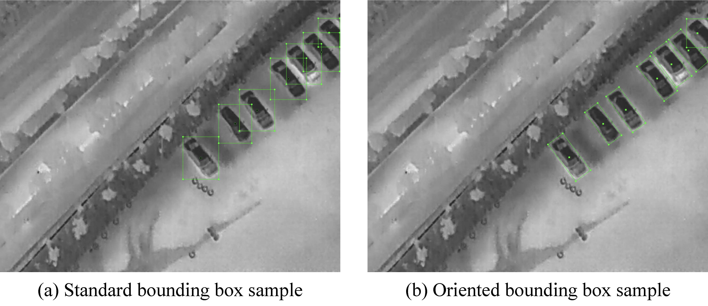
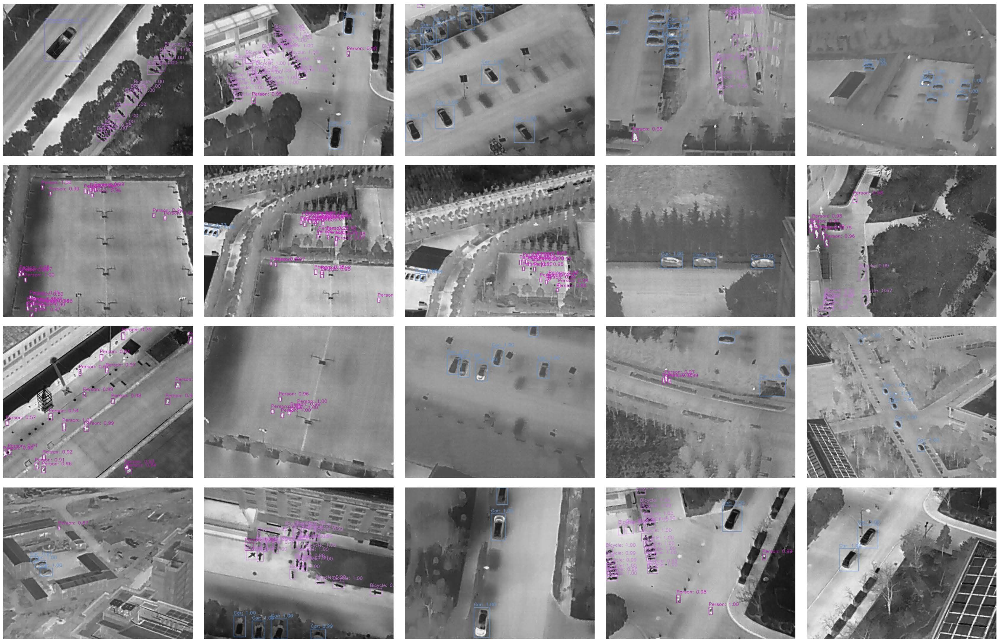

# HIT-UAV: A high-altitude infrared thermal dataset for Unmanned Aerial Vehicle-based object detection
## Introduction
The HIT-UAV contains 2898 infrared thermal images extracted from 43470 frames, captured by UAV from different scenes (schools, parking lots, roads, playgrounds, etc.), covering a wide range of aspects including objects (Person, Bicycle, Car, OtherVehicle), flight altitude data (from 60 to 130 meters), camera perspective data (from 30 to 90 degrees), and daylight intensity (day and night).

## Annotation
The HIT-UAV provide two bounding box type, oriented and standard.
The oriented annotation can decrease the overlap of bounding boxes to improve the performance of detection algorithms.  

- Standard bounding box record format: $[xc, yc, w, h]$.
- Oriented bounding box record format: $[xc, yc, w, h, \theta]$, where $\theta$ denotes the oriented angle from the horizontal direction of the standard bounding box.

<div align=center>


</div>

For each annotation method, we provide the XML and JSON label file to help user utilize the HIT-UAV:

- *normal_xml* folder: record standard bounding boxes using xml file.
- *normal_json* folder: record standard bounding boxes using json file.
- *rotate_xml* folder: record oriented bounding boxes using xml file.
- *rotate_json* folder: record oriented bounding boxes using json file.

## Sample images

The detection samples using YOLOv4.
<div align=center>

</div>

## Training Examples

YOLOv8:
https://www.kaggle.com/code/binh234/yolov8-training-on-hit-uav

## Paper
https://doi.org/10.1038/s41597-023-02066-6

## Cite
```
Jiashun Suo, Tianyi Wang, Xingzhou Zhang, Haiyang Chen, Wei Zhou and Weisong Shi. HIT-UAV: A high-altitude infrared thermal dataset for Unmanned Aerial Vehicle-based object detection. Scientific Data 10, 227 (2023).
```
or
```
@article{suo2023hit,  
    title       = {HIT-UAV: A high-altitude infrared thermal dataset for Unmanned Aerial Vehicle-based object detection},  
    author      = {Suo, Jiashun and Wang, Tianyi and Zhang, Xingzhou and Chen, Haiyang and Zhou, Wei and Shi, Weisong},  
    journal     = {Scientific Data},  
    volume      = {10},
    pages       = {227},
    year        = {2023},
    publisher   = {Nature Publishing Group UK London}
}
```
